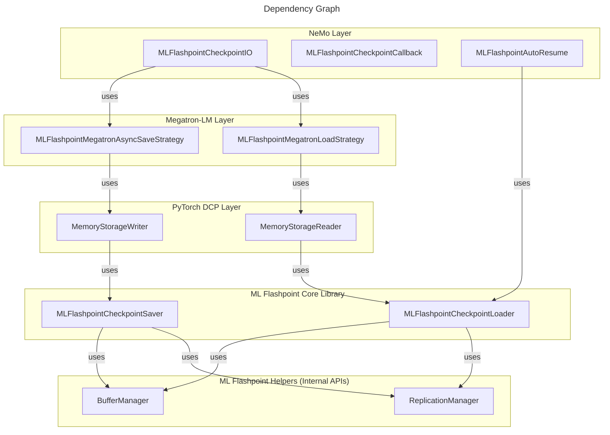

# ML Flashpoint

ML Flashpoint is a memory-first, lightning-fast, ready-to-use ML checkpointing library.

Check out the [User Guide](user-guide.md) to get started.

## Introduction

ML Flashpoint intends to be a _complementary_ checkpointing solution to your long-term checkpointing and model storage.
It (currently) primarily serves for job recovery purposes, not for long-term usage after a training job completes.

The goal is to ultimately improve your ML runtime (total time and goodput), by allowing you to:

1. Checkpoint faster by doing so in memory, and replicating to peers as backup.
1. Recover faster by recovering from an in-memory checkpoint in the cluster.
1. Checkpoint _more frequently_ with ML Flashpoint than you could or would otherwise, to improve your recovery point.
1. Checkpoint to long-term storage less frequently as a result, serving as a fallback when memory checkpoints are lost, and for long-term usage after training.
1. Free up your long-term storage bandwidth for other use cases.

ML Flashpoint saves checkpoints to shared memory, to be able to recover when the node is not lost, and automatically replicates them asynchronously to peer(s) in the training cluster, to improve resilience during node losses.
Replication has not been observed to have any negative impact on ongoing training or overall job time.
See the [overview](overview.md) for more detail.

### Performance

We performed some tests on a [Vertex AI Training Cluster](https://docs.cloud.google.com/vertex-ai/docs/training/training-clusters/overview) with 4 [A3-Mega](https://docs.cloud.google.com/compute/docs/accelerator-optimized-machines#a3-mega-vms) nodes for Gemma 27B and Llama 70B pre-training over just 300 steps and observed the improvements listed below.
These tests were conducted using ML Flashpoint _alongside_ NeMo's recommended checkpointing (as you would in production), where NeMo's default checkpointing used a 7-10 TB [Filestore](https://cloud.google.com/filestore) instance.

Observations when comparing the hybrid of ML Flashpoint (every 5 steps) and NeMo checkpointing (every 50 steps) to just NeMo's regular checkpointing (every 10 steps):
* Data write times that are up to 20-30x faster, with little to no optimization.
This is expected to further improve with additional optimizations.
* Total checkpoint recovery times that are ~7-10x faster (includes the time it takes to do checkpoint detection, cross-node coordination, replication, read into model state and be ready to resume training).
* For _async_ checkpointing: improvements averaging **3-6%** for _overall job time_, with peaks of **5-10%** improvements.
These improvements only account for checkpoint save efficiency, representing a "worst case" in the sense that checkpointing purely adds overhead and isn't actually used.
Any job interruptions will also benefit from the improved checkpoint recovery times.

While [ML runtime goodput](https://cloud.google.com/blog/products/ai-machine-learning/goodput-metric-as-measure-of-ml-productivity) is important, we focus on overall job time as an end-to-end metric, as it is most transparent and accounts for actual cost.
Goodput can be misleading if improvements to unproductive time actually worsen productive time.

## Design Philosophy

* **Decoupling**: Crash recovery checkpoints (frequent, ephemeral, high-performance) are separated from, and complementary to, long-term model storage (infrequent, persistent, standard formats).
    * This allows ML Flashpoint to use its own format and structure for recovery checkpoints, that become irrelevant after the training job is complete.
    * This also allows you to continue to use your existing solutions, storage and formats for long-term, persistent model usage (albeit at lower frequency to save costs, space and bandwidth).
* **Zero-Friction Integration**: Integration points are defined by working backward from actual customer use cases to ensure a seamless developer experience.
So reach out by raising an issue if there's a framework you want to be supported!

## System/Environment Requirements

To use ML Flashpoint, the basic requirements for the training environment are:

1. Python 3.10 or later.
1. Linux operating system on the training nodes.
1. An even number of training nodes, to use the pairwise replication strategy.
This is enforced so that the pairwise strategy doesn't put a higher memory burden on one node than the others, and so the general capacity requirements are roughly consistent across nodes.
1. A `tmpfs` mount is strongly recommended to be used for the container base path, that is separate from `/dev/shm`.
E.g. a `/tmp` mount, which can be added to `/etc/fstab` on Linux machines to mount it persistently (A3-Mega example):
    1. `tmpfs         /tmp            tmpfs           rw,nosuid,nodev,size=1024G,mode=1777,noswap,huge=within_size   0 0`
    1. `huge=within_size` is recommended to use huge pages for any files large enough, since checkpoint data is on the order of many GBs.
    1. `noswap` is recommended to avoid degrading performance.
   This can be omitted if you prefer to allow transparent disk swapping to accommodate more checkpoint storage than can fit in memory, at the cost of poorer checkpointing performance.
    1. The amount of memory needed is at least equal to the checkpoint size per node x 4, to account for replicas and in-progress checkpoints. 
   Typically, `/tmp` is set to 50% of host RAM (higher is OK).
1. The base container specified for ML Flashpoint should be specific to the running job ID, which will store all checkpoints for that job, and will be used for recovery in that particular job.
The job ID is important to include in the path because it ensures that different training jobs do not conflict, and that recovery is done correctly.
    * The assumption is that a new job ID is assigned for every new training job, and that it is reused when a job is resumed or re-queued due to an interruption.
    * The recovery logic typically (when configured correctly) always checks at job start whether some complete checkpoint is available in the job's checkpoint container, and if so will load it and resume from there.
1. When a job recovers after some interruption, it should _reuse all the same machines_ it initially used that are still healthy, only replacing machines that need to be replaced.
(If a process can be restarted without replacing the machine, recovery will be even quicker.)
Given checkpointing state is kept in-memory, this is essential to take advantage of ML Flashpoint checkpoints and be able to recover from them.
If the job is resumed or re-queued on a different set of nodes, or with a different job ID, there will be no ML Flashpoint state to recover from, forcing a fallback to the long-term storage checkpoints, which is slower.

## Framework Layers

ML Flashpoint follows a layered approach to framework support.
At the foundation is the core library, which has some PyTorch dependencies but is otherwise framework-independent.
This core library provides core functions for saving and loading, which need to be orchestrated a certain way.
See documentation for `MLFlashpointCheckpointSaver` and `MLFlashpointCheckpointLoader` for details on usage.

The higher layers do provide this orchestration.
The layers are currently (from bottom to top):

1. [PyTorch DCP](https://docs.pytorch.org/tutorials/recipes/distributed_checkpoint_recipe.html)
1. [Megatron-LM](https://github.com/NVIDIA/Megatron-LM)
1. [NeMo 2.0](https://github.com/NVIDIA-NeMo/NeMo)

Each of the layers above typically builds (and depends) on layers before it.
Other frameworks can and will be supported as needed.

### Layers Diagram

